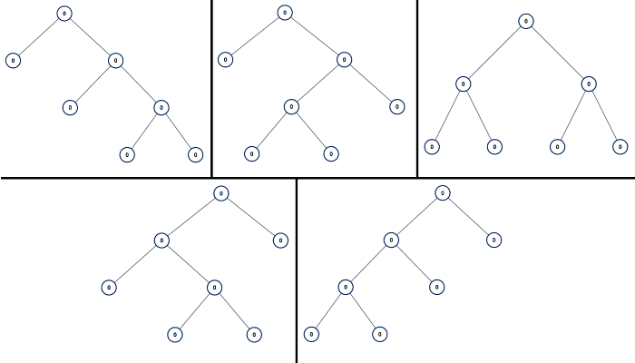

Given an integer n, return a list of all possible full binary trees with n nodes. Each node of each tree in the answer must have Node.val == 0.

Each element of the answer is the root node of one possible tree. You may return the final list of trees in any order.

A full binary tree is a binary tree where each node has exactly 0 or 2 children.

**Example 1:**




    Input: n = 7
    Output: vector of roots -> 5 roots


**Example 2:**

    Input: n = 3
    Output: vector of roots -> 1 root


```cpp

//Definition for a binary tree node.
struct TreeNode {
    int val;
    TreeNode *left;
    TreeNode *right;
    TreeNode() : val(0), left(nullptr), right(nullptr) {}
    //TreeNode(int x) : val(x), left(nullptr), right(nullptr) {}
    TreeNode(int x, TreeNode *left, TreeNode *right) : val(x), left(left), right(right) {}
};


vector<TreeNode*> fbt(int n) {

     return {};
 }


Three solutions:
0. give me some drawing, your throught process, dont code it yet
1. recursion
2. recursion with memoization
3. non-recursion with memoization

```